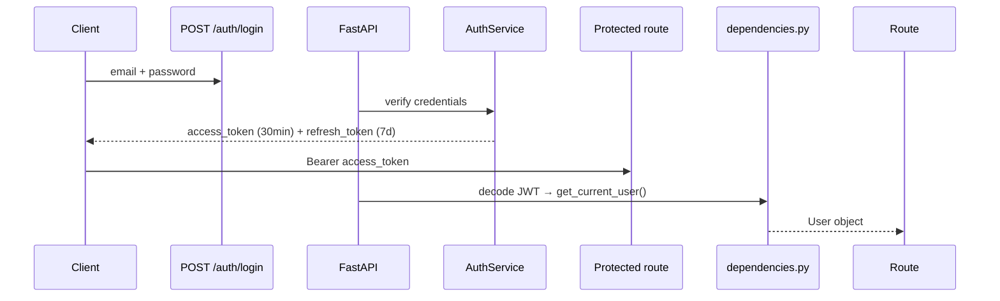

# Architecture — AR Society ERP

## Stack

| Layer | Technology |
|-------|-----------|
| API | FastAPI 0.115 |
| ORM | SQLAlchemy 2.0 |
| Database | PostgreSQL 15+ |
| Auth | JWT (python-jose) + bcrypt |
| Migrations | Alembic (manual migrations) |
| Validation | Pydantic v2 |
| Deployment | Railway |

## Layer Diagram

```
Client
  │ HTTP /api/v1
FastAPI (main.py)
  │ CORS · JWT Bearer · Exception handlers
api/__init__.py  ← all routers registered here
  │
  ├── routes/      ← HTTP only (Pydantic schemas, Depends)
  ├── services/    ← Business logic, FSM, audit, notifications
  ├── repositories/← DB queries (extend BaseRepository)
  └── models/      ← SQLAlchemy + enums + FSM dicts
```

## Module Structure

```
backend/app/
├── main.py                   # FastAPI app, middleware, router
├── api/
│   ├── __init__.py           # All routers included here
│   └── routes/               # Core routes (auth, society, etc.)
├── core/
│   ├── security.py           # JWT, bcrypt
│   └── dependencies.py       # get_current_user, require_roles()
├── db/
│   ├── base.py               # Base, TimestampMixin
│   └── session.py            # get_db, SessionLocal
├── models/
│   └── __init__.py           # All models imported here
├── modules/
│   ├── amenity/
│   ├── billing/
│   ├── complaint/
│   ├── inventory/
│   ├── notice/
│   ├── parking/
│   ├── staff/
│   ├── vendor/
│   └── visitor/
└── services/
    ├── audit_service.py
    ├── auth_service.py
    ├── notification_service.py
    ├── occupancy_service.py
    └── society_setup_service.py
```

## Database

- **80 tables** across 13 Alembic migrations
- UUID primary keys (`UUID(as_uuid=True)`)
- `TimestampMixin`: `id`, `created_at`, `updated_at`, `is_active` on every table
- Soft deletes: `is_active = False` (never hard delete)
- Multi-tenant: every table has `society_id` FK to `societies`

## Multi-Tenant Architecture

```
societies (1)
    ├── wings (N)
    │   └── flats (N)
    │       ├── residents
    │       └── tenants
    ├── staff
    ├── amenity_bookings
    ├── maintenance_bills
    └── [all other entities]
```

Every query must filter `society_id` + `is_active = True`.

## Authentication



## RBAC Architecture

`require_roles(*role_names)` returns a FastAPI dependency:
```python
def require_roles(*role_names):
    def _checker(current_user: User = Depends(get_current_user)):
        user_roles = {ur.role.name for ur in current_user.user_roles if ur.role}
        if not user_roles.intersection(set(role_names)):
            raise HTTPException(403, ...)
        return current_user
    return _checker
```

## Audit Logging

`AuditService.log()` — never raises, called from services:
```
audit_logs table: action, module, entity_type, entity_id, user_id, old/new values, timestamp
```

## Notifications

`NotificationService.send()` — in-app only currently:
```
notifications table: user_id, title, body, type, channel, is_read
```
Future: SMS, WhatsApp, Push — hooks already in services.

## Authentication — must_change_password

Users onboarded by admins have `must_change_password = True`. On login the
Flutter app reads this flag from `GET /auth/me` (`UserOut.must_change_password`)
and redirects to `/change-password` before allowing access to any other route.
The flag is cleared server-side by `POST /auth/change-password`.

## Current Scale
- **255 routes** across 13 modules (added `GET /staff/by-user/{user_id}`, `POST /auth/change-password`)
- **80 tables**, **13 migrations**
- **171 tests** (SQLite, no external DB) — amenity, parking, inventory, notice, vendor, staff tasks added
